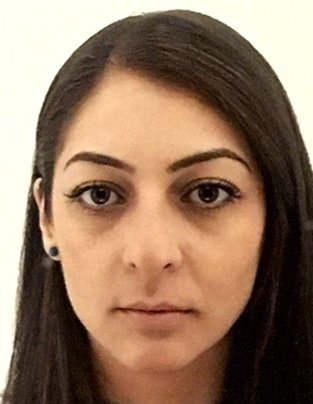

---
---

<link rel="stylesheet" href="styles.css" type="text/css">

I grew up in the second largest city of Armenia, Gyumri. I obtained Bachelor degree in Informatics and Applied Mathematics from Yerevan State University, Armenia. Afterwards, I received Master’s degree in Applied Mathematics from EPFL and gained further experience while working in Nuclear power plant in Goesgen. Since March 1st, I am enrolled in the Epidemiology and Biostatistics PhD program under the supervision of PD Dr. Malgorzata Roos. The aim of my project is to find a formal way of assessing sensitivity diagnostics in Bayesian Hierarchical models.

My full CV is available [here](cvSonaHunanyan.pdf).